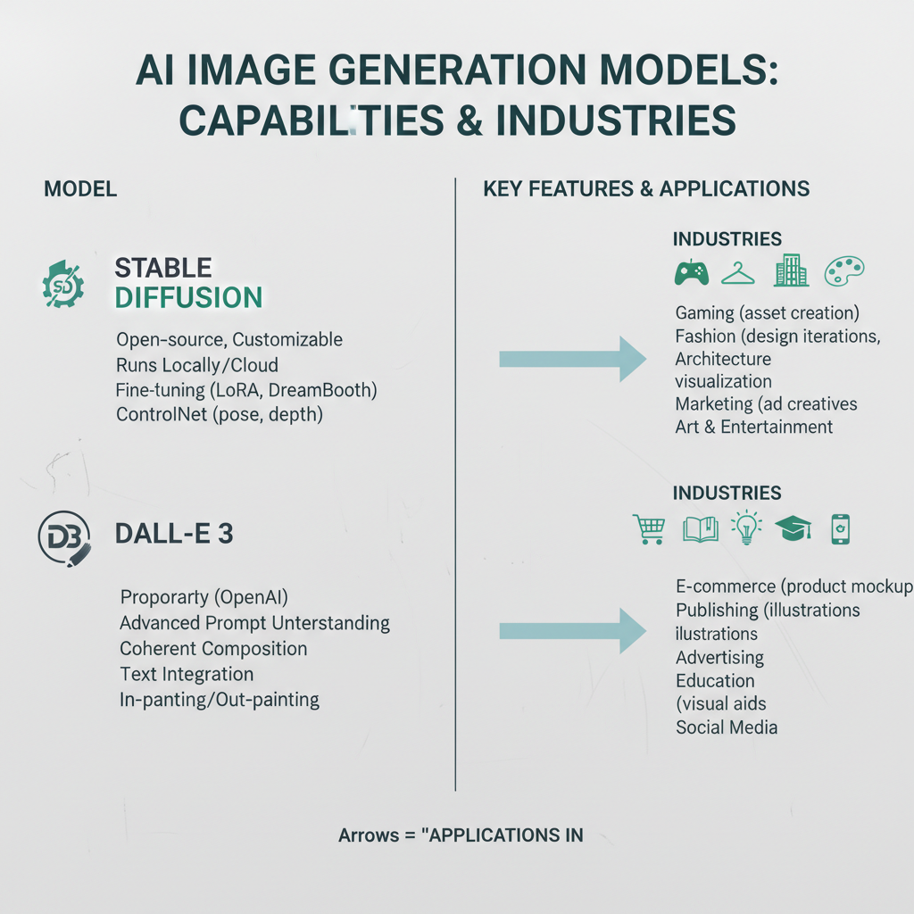

# The Evolution of Image Generation Models: A Brief History and Future Directions

## Introduction to Image Generation Models: A Historical Overview

Image generation models have come a long way since their inception, initially constrained by simplistic algorithms and computational limits. Early models, such as basic neural networks, struggled with image fidelity and often produced low-resolution outputs. These limitations hindered practical applications in creative fields, making them less valuable for artists and designers.

In recent years, the landscape of image generation has evolved significantly. The introduction of advanced models like diffusion and GANs (Generative Adversarial Networks) has transformed the capabilities of image synthesis. By 2026, models like Stable Diffusion and DALL-E 3 are now the industry standard, delivering high-quality, detailed images from textual descriptions. Their effectiveness in generating images for marketing, design, and gaming has made them essential tools for professionals in these fields ([Generative AI Models in 2026](https://www.refontelearning.com/blog/generative-ai-models-in-2026-top-trends-breakthroughs-and-opportunities)).

As we look forward to future trends in image generation, we can expect even greater advancements. Anticipated developments include higher resolutions (4K+), improved understanding of prompts, and faster generation times. The competitive atmosphere among platforms will drive rapid innovation, making sophisticated AI tools accessible to a broader audience ([Best AI Image Generation Models in 2026](https://www.pixazo.ai/blog/ai-image-generation-models-comparison)).

Moreover, image generation fits into the broader context of AI technology, where creativity and automation increasingly intersect. The rise of multi-model platforms indicates a significant shift in user preference towards diverse tools that cater to varied project needs ([AI Image Generation in 2026](https://aijourn.com/ai-image-generation-in-2026-why-multi-model-platforms-are-replacing-single-tool-workflows/)). As this technology continues to advance, it will likely redefine creative practices and offer new mediums for artistic expression.

## Current Landscape of AI Image Generation in 2026

As of 2026, the landscape of AI image generation is primarily defined by powerful models such as **Stable Diffusion** and **DALL-E 3**. These diffusion models have become integral in various industries including marketing, design, and gaming due to their remarkable ability to produce high-quality, detailed images based on text prompts ([Generative AI Models in 2026](https://www.refontelearning.com/blog/generative-ai-models-in-2026-top-trends-breakthroughs-and-opportunities)). 

### Key Features of Dominant Models
- **Stable Diffusion**: Known for its versatility, this model excels in generating images with complex details while efficiently processing user prompts.
- **DALL-E 3**: Features extended capabilities in text rendering and artistic style control, allowing users to create imaginative and nuanced images that align with creative visions.

*An overview of key AI image generation models showcasing features and applications.*

### Impact on Creative Fields
AI image generation is transforming creative sectors:
- **Marketing**: Companies use these models to create personalized visual content quickly, enhancing customer engagement and streamlining advertising campaigns.
- **Gaming**: Developers leverage AI to design immersive environments and unique character designs, significantly reducing production times while pushing the boundaries of creativity.

### Rise of Multi-Model Platforms
The trend towards **multi-model platforms** is reshaping how creators access and utilize AI tools. These platforms allow users to switch between different models based on specific project needs, leading to enhanced specialization and improved quality of generated content ([AI Image Generation in 2026](https://aijourn.com/ai-image-generation-in-2026-why-multi-model-platforms-are-replacing-single-tool-workflows/)). This flexibility is crucial in an era where the diversity of requirements is growing, from marketing visuals to detailed game assets.

### Conclusion
In summary, the continued evolution of models like Stable Diffusion and DALL-E 3, alongside the integration of multi-model platforms, illustrates a robust and dynamic future for AI-generated imagery. These advancements not only empower creators across various fields but also pave the way for innovative applications previously thought impossible, ultimately transforming the digital creative landscape.

## Key Trends Shaping the Future of Image Generation Models

As we move further into 2026, several key trends are driving the evolution of image generation models, profoundly influencing how these technologies are deployed in creative contexts.

- **Authenticity and Imperfection**: There's a noticeable shift towards favoring authenticity over polished perfection in visual content. According to a recent analysis, audiences are increasingly drawn to images that reflect imperfection and nostalgia. This trend is shaping AI-generated visuals to serve as creative collaborators, yielding work that connects on a more emotional level with viewers ([Source](https://ltx.studio/blog/ai-image-trends)).

- **Rise of Multi-Model Platforms**: The landscape is moving towards multi-model platforms rather than single-tool workflows. In 2026, users demand diverse image generation tools to cater to varied project requirements. These platforms allow for specialization, ensuring higher quality outcomes by leveraging different generators for specific tasks. This adaptability makes it easier for creatives to navigate their workflows efficiently, accommodating unique needs and creative directions ([Source](https://aijourn.com/ai-image-generation-in-2026-why-multi-model-platforms-are-replacing-single-tool-workflows/)).

- **User Demands Driving Innovation**: The rapid pace of innovation in image generation technology is largely fueled by user expectations. As users become more sophisticated, they seek higher resolutions and enhanced capabilities, including improved text rendering and faster generation times. The competition among platforms is a significant factor, resulting in a continuous loop of feedback that drives advancements in both functionality and user experience ([Source](https://www.pixazo.ai/blog/ai-image-generation-models-comparison)).

These intertwined trends highlight a transformative period in the realm of AI image generation, emphasizing a move towards genuine, relatable visuals, enhanced creative tools, and a user-centric approach to technological development. As these dynamics unfold, they will likely lead to even more innovative applications in marketing, design, and beyond.

## Conclusion: The Way Ahead for Image Generation Models

The advancements in image generation models over recent years are remarkable, marked by significant improvements in resolution and understanding of prompts. As we move into 2026, users can expect resolutions upwards of 4K, enhanced text rendering, and more sophisticated style control from platforms like Stable Diffusion and DALL-E 3 ([Source](https://www.refontelearning.com/blog/generative-ai-models-in-2026-top-trends-breakthroughs-and-opportunities)). These developments indicate a robust competition between platforms, driving rapid innovation and democratizing access to powerful AI capabilities.

Looking ahead, generative AI will continue to evolve in several ways:

- **Greater Accessibility**: The rise of multi-model platforms will enable users to choose among various generators, catering to diverse project needs. This flexibility enhances specialization and improves overall content quality ([Source](https://aijourn.com/ai-image-generation-in-2026-why-multi-model-platforms-are-replacing-single-tool-workflows/)).
- **Authenticity in Imagery**: Future trends suggest a demand for authentic, imperfect imagery, promoting a shift away from overly polished visuals. This trend will serve as a creative collaboration, appealing to audiences through nostalgia and experimentalism ([Source](https://ltx.studio/blog/ai-image-trends)).
- **Dominance of Diffusion Models**: As diffusion models become increasingly integral in fields like marketing, design, and gaming, their ability to generate high-quality images from text prompts positions them as invaluable tools for creative professionals ([Source](https://www.gradually.ai/en/ai-image-models/)).

For those interested in the evolution of image generation models, staying informed about these upcoming developments is crucial. The landscape is set to change rapidly, and being aware of these trends will empower users to leverage these technologies effectively in their respective fields.