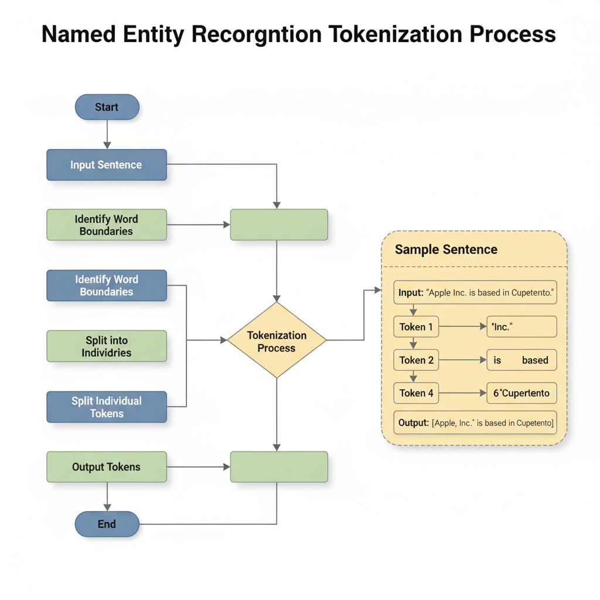
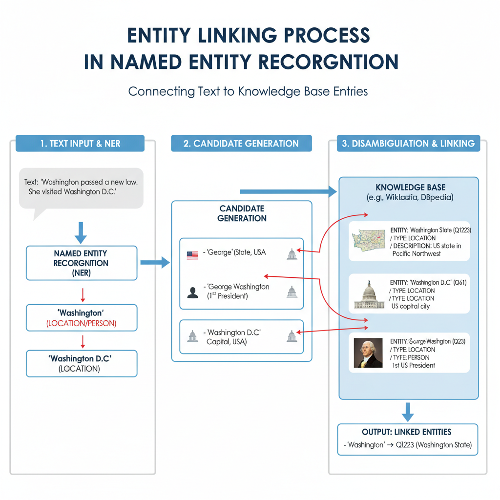
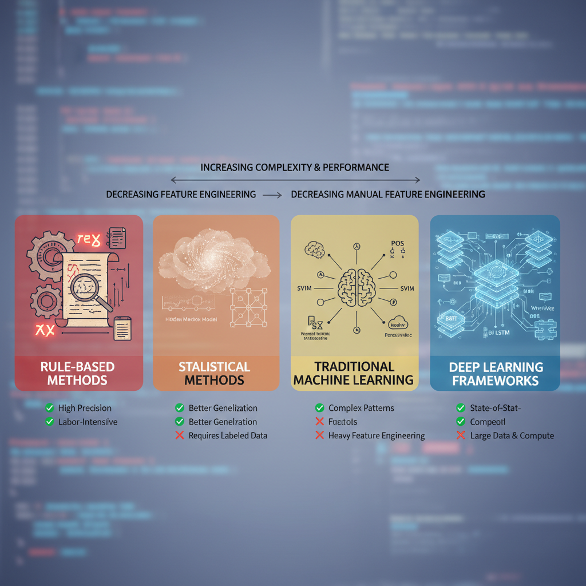

# Understanding Named Entity Recognition: Fundamentals and Applications

## What is Named Entity Recognition?

Named Entity Recognition (NER) is a crucial process in Natural Language Processing (NLP) that involves identifying and classifying key entities in text into predefined categories such as names of persons, organizations, locations, dates, and more. Essentially, NER helps in segmenting and labeling these entities, making unstructured text manageable and useful for various applications.

NER's significance in NLP cannot be overstated. It serves as a foundational step for many complex tasks, including information retrieval, sentiment analysis, and machine translation. By extracting entities from text, NER allows systems to better understand context and meaning, enabling more accurate responses and interactions. For instance, recognizing a person's name allows a system to connect it with other relevant data about that person, enhancing user experience and data interpretation.

Common applications of NER span multiple domains and industries. Some of the most notable applications include:

- **Search Engines**: Enhancing search algorithms by providing context-specific results.
- **Chatbots and Virtual Assistants**: Improving user interactions by recognizing and responding to named entities like events, products, or people.
- **Content Recommendation Systems**: Personalizing content delivery based on identified interests and entities present in user interactions.
- **Healthcare**: Extracting relevant entities from medical records to assist in research and decision-making.
- **Finance**: Identifying and classifying entities related to markets, companies, and economic indicators for data analysis.

NER continues to evolve alongside advancements in machine learning and AI, making it an integral part of modern NLP technologies. As more sophisticated models are developed, the accuracy and applicability of NER will only improve, opening new avenues for its use across various fields.

## Components of Named Entity Recognition

Named Entity Recognition (NER) is a critical task in Natural Language Processing (NLP) aimed at identifying and classifying key entities in text into predefined categories such as names of people, organizations, locations, and more. Understanding the components that constitute a NER model is essential for developing effective applications. 

### Tokenization

Tokenization is the first step in any NER system. It involves breaking down a text into smaller units, or tokens, which can be words, phrases, or even sub-words. This step is crucial as it prepares the text data for subsequent analysis. For example, the sentence "Apple Inc. is based in Cupertino." would be tokenized into tokens like "Apple", "Inc.", "is", "based", "in", and "Cupertino". Effective tokenization ensures that the structure and meaning of the text are maintained for further processing.  
*Tokenization process in NER showing how a sentence is broken into tokens.*

### Part-of-Speech Tagging

Once the text is tokenized, the next step is part-of-speech (POS) tagging. This involves assigning a grammatical category to each token, such as noun, verb, adjective, etc. POS tagging provides context that can significantly enhance the accuracy of entity recognition. For instance, knowing that "Apple" is a noun helps the model infer that it could be a named entity. This layer of linguistic information assists in distinguishing entities amidst ambiguous terms, such as "bank" which could refer to a financial institution or the side of a river.

### Entity Classification

Entity classification is the core function of NER. In this phase, the model identifies the tokens that correspond to named entities and assigns them to specific classes, like "PERSON," "ORGANIZATION," or "LOCATION." The entity classification is important for the downstream applications of NER, ensuring that relevant entities are highlighted for tasks such as information extraction or question answering. Advanced models employ machine learning algorithms, which are trained on labeled datasets to improve the precision of classification.

### Entity Linking

Entity linking is the final component, connecting the recognized entities to knowledge bases or databases. This step goes beyond simple classification; it strives to resolve ambiguities by ensuring that an entity identified in the text corresponds to a unique entry in a knowledge source. For example, distinguishing between "Washington" the state and "Washington" the capital of the USA can be tackled during this process by referencing their respective identifiers in databases like Wikidata or DBpedia. Successful entity linking enhances the utility of the information extracted by providing additional context and relations.   
*Entity linking process in NER demonstrating how recognized entities are connected to knowledge bases.*

These components work together to create an efficient NER model that not only recognizes named entities but also contextualizes and relates them to existing knowledge, setting the groundwork for more advanced information retrieval and understanding tasks in NLP.

## Types of Named Entities

Named Entity Recognition (NER) systems are designed to identify and classify key elements within unstructured text. These entities fall into several categories, each serving a unique purpose in the context of natural language processing (NLP). Here are the primary types of named entities that NER systems typically recognize:

- **Person Names**: This category includes the names of individuals, either famous or ordinary. NER systems are capable of distinguishing between first names, last names, and titles to efficiently recognize entities such as "Albert Einstein" or "Madam Curie."

- **Organization Names**: This type encompasses companies, institutions, agencies, and other group entities. For instance, "Google," "United Nations," and "Harvard University" are examples of organization names that are recognized in text. Organizations often have specific identifiers, such as acronyms, which NER systems can also identify.

- **Location Names**: Geographic locations are vital components in many datasets. This category includes countries, cities, and other types of geographical references. Examples include "France," "New York," and "Mount Everest." Accurate recognition of location names is crucial for applications requiring geographical context.

- **Date and Time Expressions**: Date and time information is essential for understanding the temporal context in documents. NER systems can recognize various formats like "March 22, 2026," "next Tuesday," or "2 PM on a Friday," aiding in tasks that require chronological insight.

- **Miscellaneous Entities**: This category serves as a catch-all for any entities that do not fit neatly into the previous classifications. It may include specific events ("Olympics"), works of art ("Mona Lisa"), or products ("iPhone"). This flexibility allows NER systems to adapt to diverse textual datasets.

Different NER systems may vary in their ability to classify these entities accurately, depending on their training data and underlying algorithms. Understanding these categories is crucial for effectively applying NER technologies in various applications, such as information retrieval, content classification, and data analysis.

## Techniques Used in Named Entity Recognition

Named Entity Recognition (NER) is a crucial component of Natural Language Processing (NLP) that involves identifying and classifying key information in text, such as names of people, organizations, locations, and more. There are several techniques employed in NER, and they can be broadly classified into four categories: rule-based methods, statistical methods, machine learning approaches, and deep learning frameworks.  
*Table comparing various techniques used in Named Entity Recognition, including rule-based, statistical, machine learning, and deep learning methods.*

### Rule-based Methods

Rule-based methods utilize handcrafted rules and patterns to identify named entities. These methods typically rely on:

- **Lexicons:** A predefined list of names and terms to match against the text.
- **Pattern Matching:** Employing regular expressions and linguistic patterns to capture entities based on their structure.
- **Heuristics:** Logical rules based on common entity attributes, such as capitalization or specific grammatical constructions.

While rule-based methods can be highly accurate for specific domains, they are often limited in scope and must be manually updated and maintained to account for changes in language and entities.

### Statistical Methods

Statistical methods leverage algorithms to analyze patterns in a given corpus of text. These techniques often involve:

- **N-grams:** Utilizing sequences of 'n' items from a given sample of text to identify patterns.
- **Hidden Markov Models (HMM):** A probabilistic model that uses states, transitions, and observations to define relationships between words and entities.
- **Conditional Random Fields (CRF):** A framework that considers the context of each word, allowing for the incorporation of neighboring words in the decision-making process.

Although these methods marked an improvement over purely rule-based systems by allowing for some context-based flexibility, they still rely on significant amounts of labeled training data and may struggle with ambiguous cases.

### Machine Learning Approaches

Machine learning approaches emerged as a significant advancement in NER. They often include the use of supervised learning to train models based on annotated datasets. Key techniques include:

- **Feature Engineering:** Extracting relevant features from text, such as part-of-speech tags, word embeddings, or contextual information, to improve model accuracy.
- **Algorithm Selection:** Utilizing well-established classifiers like Support Vector Machines (SVM), decision trees, or ensemble methods to perform entity classification.

While machine learning approaches help improve results, they still require tedious feature extraction and tuning processes and often need extensive labeled data to perform well.

### Deep Learning Frameworks

Recently, deep learning frameworks have transformed the way NER is approached. These methods use neural networks, which can automatically learn features from the raw text data. Popular frameworks are:

- **Recurrent Neural Networks (RNNs):** Effective for sequential data, RNNs can remember previous words while processing text, making them suitable for NER tasks.
- **Long Short-Term Memory Networks (LSTMs):** A variant of RNNs that can better handle long-range dependencies in text data.
- **Transformers:** Models like BERT and GPT have reshaped how context is understood in NER, allowing for significant improvement in performance.

Deep learning frameworks reduce the manual labor associated with feature extraction and generally yield better results on complex NER tasks due to their ability to capture intricate relationships in data. However, they often require substantial computational resources and large datasets to train effectively.

In summary, the evolution of NER techniques—from rule-based to statistical, machine learning, and finally deep learning—illustrates the growing sophistication of this field. Each approach has its strengths and weaknesses, and the choice of model often depends on the specific requirements of the task at hand.

## Challenges in Named Entity Recognition

Named Entity Recognition (NER) is a key task in natural language processing that identifies and categorizes entities within text. However, implementing effective NER systems involves navigating several significant challenges.

### Ambiguity and Context Issues

One of the primary challenges in NER is ambiguity. Words can have multiple meanings depending on their context. For example, the term "apple" could refer to either the fruit or the technology company. This ambiguity complicates the entity recognition process, as the system must consider the surrounding text to disambiguate such terms. Contextual understanding is essential for accurately tagging an entity, but constructing models that can effectively utilize context remains a complex task.

### Domain-Specific Challenges

NER is often hindered by domain-specific language. Different fields have unique terminologies and conventions. For instance, medical NER systems must recognize entities like "diabetes" or "metformin," which may not be as relevant in a finance-related context. This domain variability requires training models on specialized datasets, which can be resource-intensive and may not generalize well across different domains.

### Data Sparsity and Noise

Another significant obstacle is data sparsity and noise in training datasets. Effective NER systems require large amounts of annotated data to learn patterns and improve accuracy. However, gathering sufficient data that is both comprehensive and representative can be challenging. Moreover, existing datasets often contain noise—irrelevant or erroneous information—that can mislead the training process and reduce the model's overall performance.

### Performance Evaluation Metrics

Evaluating NER systems poses its own set of challenges. Common performance metrics, such as precision, recall, and F1 score, can provide insight into model effectiveness, but they do not always capture the real-world usability of the system. For instance, a high F1 score may not necessarily translate to success in practical applications where specific entity types or domain accuracy are more critical. Consequently, defining appropriate evaluation metrics tailored to specific use cases is an ongoing challenge in the field.

In summary, while NER technologies continue to advance, addressing issues related to ambiguity, domain specificity, data quality, and performance assessment remains crucial for enhancing their effectiveness and reliability.

## Future Trends in Named Entity Recognition

Named Entity Recognition (NER) continues to evolve rapidly, driven largely by advancements in deep learning. Neural network architectures, particularly transformers, have revolutionized the way NER systems are designed. These models, like BERT and GPT, enable more sophisticated understanding of context and relationships between words, leading to significant improvements in entity extraction accuracy. As companies increasingly adopt these technologies, we can expect even more refined models that leverage extensive pre-training on diverse datasets.

Additionally, there is a growing trend towards integrating NER with other natural language processing (NLP) tasks. For instance, combining NER with sentiment analysis or text summarization can yield richer insights from unstructured text. Such integration allows systems to deliver a more holistic view of content, effectively enabling applications in business intelligence, customer feedback analysis, and beyond. As these models become more intertwined, they will unlock new potentials for cross-task performance, improving user experience and operational effectiveness.

The push for more accurate entity recognition is another vital trend. While current systems have made great strides, challenges remain in accurately identifying entities in non-standard contexts, such as social media or informal language. Future research is likely to focus on fine-tuning models specifically for these environments, enhancing their ability to adapt to diverse vocabularies and usages. These enhancements will also facilitate better handling of ambiguous named entities, which frequently cause confusion in traditional models.

Lastly, improved efficiency and scalability are essential for the future of NER. As organizations generate vast amounts of data daily, the need for NER systems that can process this data in real time becomes crucial. Optimizing models to reduce latency and resource consumption will allow more organizations to deploy effective NER solutions across various platforms. Techniques such as model distillation and quantization may be employed, enabling complex models to run on less powerful hardware without sacrificing performance.

In summary, the future of Named Entity Recognition looks promising with ongoing advancements in deep learning, integration with other NLP tasks, improved accuracy, and enhanced efficiency. As researchers continue to innovate, NER will play a prominent role in transforming how we interact with and analyze language data.